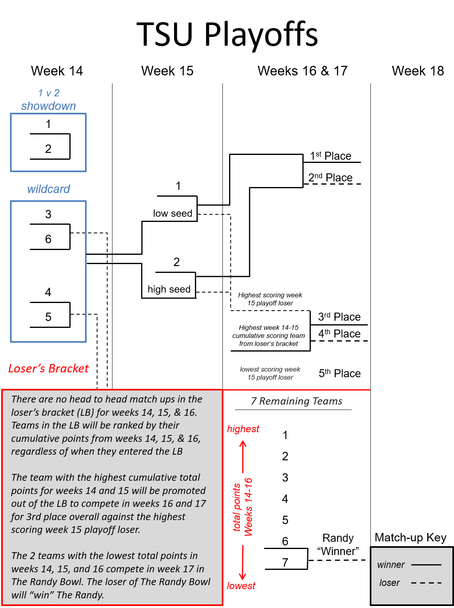

# Playoffs

## When

### The regular season of TSU will conclude with NFL week 13.

### The first week of TSU playoffs will be week 14 (TSU wildcard week).

### ESPN cannot accommodate our custom playoff structure, so the matchups will be set manually each week by the commissioner.  An up-to-date playoff bracket will be supplied to everyone during each week of the playoffs.

### Final season rankings for teams will be determined by their individual performances in the playoff structure that is outlined a drawn below.

## Overall Structure
```{r, out.width="90%", echo=FALSE}

```

## Winner's Bracket

### The playoff structure for the `r current_season` season will be a customized system with the winner’s bracket beginning with the top 6 seeded teams in the league. 

### Teams will first be ordered on overall regular season record.

### If two teams end the regular season with the same overall record the following tiebreak steps will be used until one of the steps breaks the tie:
1. Head to head record
1. Total points for on the season (the team with the most post for would win the tie)
1. Total points against on the season (the team with the most points against would win the tie)
1. Coin Toss

### If three or more teams end the regular season with the same overall record the following tiebreak steps will be used to break the tie:
#### All tied teams will be ordered based on their win percentage against the other teams involved in the tie (this does not include wins or loses against teams who are not involved in the tie). The team with the highest win percentage amongst tied teams will receive the highest available seed and the lowest win percentage will receive the lowest seed.
#### If two or more teams have the same win percentage amongst tied teams the following steps will be used until the tie is broken:
1. Total points for on the season	
1. Total points against on the season
1. Best worst week - Most points scored in the teams worst week
1. Coin Toss

### Playoffs – Round 1(wildcard weekend)
#### Round 1 of the playoffs (week 14) will be a single elimination game for seeds 3-6.

#### The losers of the wildcard matchup will drop down into the loser’s bracket.

#### The top two seeds will have a “bye” week for week 14
##### There will be a 1 vs. 2 friendly match during wildcard week with the winner securing a payout listed in payouts section. A win or loss will not have an effect on either team.

#### The winners of the wildcard games will advance to play the 1 and 2 seeds in week 15.
##### The lowest seeded wildcard winner will be paired against the 1st seeded team.

### Playoffs – Round 2
#### Round 2 of the playoffs (week 15) will be a single elimination game for all remaining seeds in the winner’s bracket. 

#### Highest scoring loser in Round 2 of the playoffs (week 15) will move into the 3rd place matchup.
##### If the two losing teams in Round 2 of the playoffs scored the same total points in week 15. The team with the highest playoff seeding will advance to the 3rd place matchup

#### The lowest scoring loser in Round 2 of the playoffs does not drop into the loser's bracket and is locked in at finishing 5th overall


### Playoffs – Round 3 (Championship & 3rd place matchup)
#### Round 3 off the playoffs (weeks 16 & 17) will be a two week cumulative score matchup for both the Championship and the 3rd place matchup

#### The Championship
##### The team with the most cumulative points for week 16 and week 17 will be the winner and declared the Champion of TSU, blessed by thy name.
##### The loser of the championship matchup will finish in 2nd place.

#### The 3rd Place Matchup
##### The 3rd place matchup will be against the highest scoring loser of Round 2 of the playoffs vs the team from the losers bracket with the highest cumulative total points for weeks 14 and 15.
##### The team with the most cumulative points for week 16 and week 17 will be the winner and declared the 3rd place finisher.
##### The loser of the 3rd place matchup will finish in 4th place.


## Loser's Bracket
### There are no head to head matchups in the loser’s bracket for weeks 14, 15, & 16. Teams in the loser’s bracket will be ranked by their cumulative points from weeks 14, 15, & 16, regardless of when they entered the loser’s bracket.


### The team with the highest cumulative total points for weeks 14 and 15 will be promoted out of the loser's bracket to compete in weeks 16 and 17 for 3rd place overall 

### The 2 teams with the lowest total points in weeks 14, 15, and 16 compete in week 17 in The Randy Bowl. The loser of The Randy Bowl will contract The Randy.

## The Randy Bowl
### The 2 teams ranked 11th and 12th (the lowest scores) in total points for weeks 14, 15, & 16 compete in week 17 in The Randy Bowl.
### The winner of The Randy Bowl takes 11th place overall.
### The loser of The Randy Bowl takes 12th place overall and contracts The Randy.

