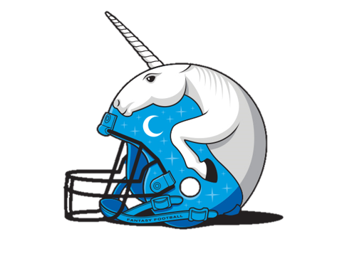

--- 
title: "The Constitution of The Saturated Unicorn"
author: "Professed by the members of TSU, scribed by Noah Newport and Jesse Piburn"
date: "`r Sys.Date()`"
output_dir: "docs"
bibliography:
- book.bib
- packages.bib
description: This document represents the rules, bylaws, and moral guidance of TSU
documentclass: book
link-citations: yes
site: bookdown::bookdown_site
biblio-style: apalike
---

# The Constitution of The Saturated Unicorn {-}

```{r, out.width="100%", echo=FALSE}

```
